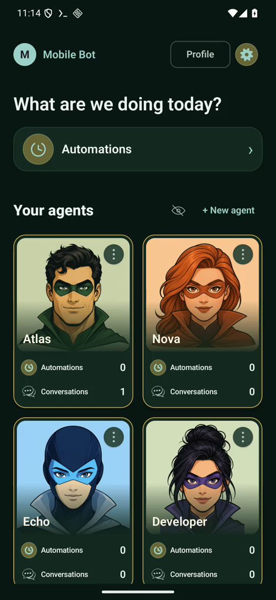
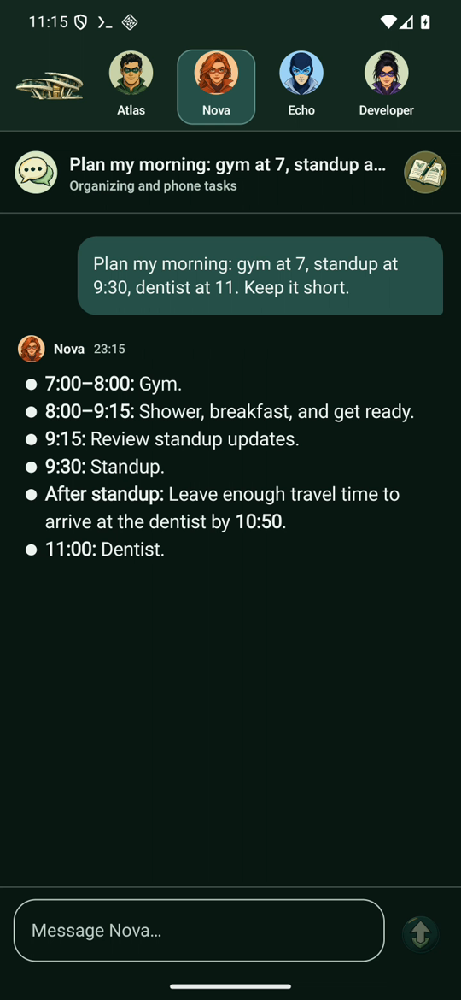
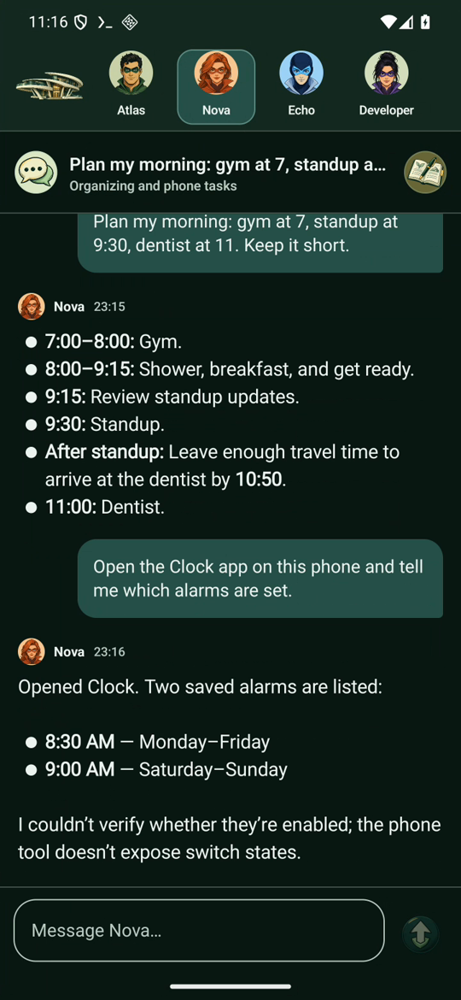

# Mobile Bot

Mobile Bot runs a team of AI agents on your Android phone. You give each agent a role, chat with it, let it repeat a task every 15 minutes, and allow it to use the apps on your phone: it can open an app, read the screen, tap and type.

The agents run on [Codex CLI](https://github.com/openai/codex) inside [Termux](https://termux.dev), signed in with your own ChatGPT account. The app talks to them through a small local host that only listens on the phone itself. An experimental on-phone model (Qwen3.5 0.8B) can replace Codex for private, offline conversations.

**Watch the 3-minute tutorial:** [Mobile Bot on YouTube](https://www.youtube.com/watch?v=2nupIyCnAdk)

<p align="center">
  
  
  
</p>

> **Experimental software.** Agents run Codex without its approval prompts and, when you turn on phone control, can operate other apps on the phone. Read [Security](#security) before you install it on a phone with personal data.

## What it does

- **Agents with roles.** Six agents are ready to use: Atlas (research), Nova (organizing and phone tasks), Echo (writing), Developer (Android apps), Mail and Shopping. Create your own with a name, a role and an avatar, or hide the ones you do not need.
- **Chat.** Each agent keeps its own conversations and a permanent working folder, so it can pick up earlier work.
- **Phone control.** With the Android accessibility service turned on, an agent can open apps, read what is on screen, tap, scroll and type, then return to Mobile Bot with the result. It asks before sending messages, buying or deleting anything outside its folder.
- **Automations.** Ask an agent to check something every 15 minutes, for example a forecast or a price. Automations survive restarts, wait when the phone is locked, and can be paused with a switch.
- **Powers.** Powers are Codex skills. Assign built-in powers to an agent or describe a new one; the workshop researches, builds and tests it before it shows up in the library.
- **Agent files.** Read the Markdown notes and results an agent saved in its folder.
- **Themes.** Superheroes, Office, Animals and Influencers, each with its own avatars and colors. Agents can also create custom color themes.
- **English and Polish.** The app follows the phone language, or the per-app language in Android 13+.

## Requirements

- Android 11 or newer (arm64 phone or emulator).
- [Termux](https://github.com/termux/termux-app/releases) 0.118 or newer from GitHub or F-Droid. The Google Play build of Termux does not support the commands Mobile Bot needs.
- A ChatGPT account that can use Codex. You sign in yourself; the app never sees your password.
- Free space for Termux packages and Codex, plus 533 MB if you download the on-phone model.

## Install

There is no store listing. Build the APK yourself (see [Development](#development)) or download one from the [Releases](../../releases) page when available, then:

1. Install Mobile Bot and open it. The **First mission** screen walks you through setup.
2. **Base:** tap **Set up the app**. If Termux is missing, the app opens the official Termux release to install.
3. Allow Mobile Bot to run commands in Termux, then copy the one-line command the app prepares, paste it in Termux and come back.
4. Tap **Start**. Mobile Bot installs Node.js, Codex CLI and its host in Termux. This takes a few minutes on the first run.
5. Tap **Sign in to Codex**, open the link shown in Termux on any device and enter the one-time code.
6. **Phone (optional):** turn on *Agent phone control* in Android **Settings → Accessibility** if you want agents to use other apps.
7. **Mission:** send your first task to an agent.

The full walkthrough with screenshots is in the [user guide](docs/GUIDE.md).

## How it works

```
┌──────────────── Android phone ─────────────────────────────────────────┐
│                                                                        │
│  Mobile Bot app (Kotlin, Jetpack Compose)                              │
│   ├─ chat, agents, powers, automations, files                          │
│   └─ accessibility bridge  ◄── 127.0.0.1:8768 (token) ──┐              │
│            │ 127.0.0.1:8767 (token)                      │              │
│            ▼                                             │              │
│  Termux                                                  │              │
│   ├─ Mobile Bot host (Node.js, SQLite)                   │              │
│   │    ├─ scheduler for 15-minute automations           │              │
│   │    └─ one working folder per agent                   │              │
│   ├─ Codex CLI  ──► OpenAI (your ChatGPT sign-in)         │              │
│   └─ phone-client.mjs ───────────────────────────────────┘              │
└────────────────────────────────────────────────────────────────────────┘
```

Each message starts a Codex run in the agent's folder with an `AGENTS.md` that describes its role, its powers and the phone tool. Details are in [docs/ARCHITECTURE.md](docs/ARCHITECTURE.md).

## Security

- The host and the accessibility bridge listen only on `127.0.0.1` and require a random 256-bit device token shared between the app and Termux. Web pages and other apps on the phone cannot call them.
- Codex runs with `--dangerously-bypass-approvals-and-sandbox` inside Termux. Within the Termux sandbox an agent can read and change files, install packages and use the network.
- Phone control lets an agent act in any app it can see. Agents are instructed to ask before sending messages, publishing, buying or deleting, but that is an instruction to a model, not a technical guarantee. Turn the accessibility service off when you do not need it.
- Passwords, PINs, codes and privacy decisions are always yours to enter.

Report vulnerabilities as described in [SECURITY.md](SECURITY.md).

## Development

The repository has two parts:

| Path | What it is |
| --- | --- |
| `app/` | Android app, Kotlin and Jetpack Compose |
| `host/` | Termux host in TypeScript; its build is copied into `app/src/main/assets` |

Requirements: JDK 17+, Android SDK 36, Node.js 24.

```bash
npm --prefix host ci
npm --prefix host test          # builds the host, syncs the app assets, runs 87 tests
./gradlew testDebugUnitTest lintDebug assembleDebug
adb install -r app/build/outputs/apk/debug/app-debug.apk
```

Run `npm --prefix host test` after every host change: it rebuilds `host.mjs` and the other modules the app installs in Termux. Raise `HOST_VERSION` in `host/src/index.ts` and `TermuxContract.kt` together so installed phones pick up the new host.

Instrumented UI tests run on a connected device or emulator with `./gradlew connectedDebugAndroidTest`. They reinstall the app, which turns the accessibility service off again on Android 16.

See [CONTRIBUTING.md](CONTRIBUTING.md) before opening a pull request.

## Known limitations

- Automations run every 15 minutes; other intervals are not supported yet.
- The phone tool reads text and labels, not the on/off state of switches.
- The on-phone model is small and often fails multi-step phone tasks. Use Codex for anything that matters.
- The choice between Codex and the on-phone model is only offered during setup.
- Powers built in the workshop cannot be deleted from the app yet.
- Agents cannot pass the lock screen. Automations that need the phone wait until it is unlocked.

## License

[MIT](LICENSE)
